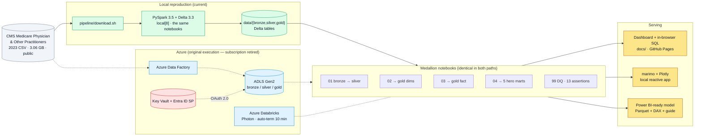

# Medicare Reimbursement Gap Analyzer — an Azure Healthcare Lakehouse

**[View the live dashboard →](https://diazsk.github.io/healthcare-lakehouse-azure/)**

An end-to-end **data lakehouse** over the CMS *Medicare Physician & Other Practitioners by
Provider and Service* dataset — **9.66 million claim rows** transformed through a
**Medallion architecture** (Bronze → Silver → Gold) in **PySpark on Delta Lake**, surfacing
five billing-anomaly insights through an analytics dashboard that runs SQL over all
9.66 million rows **in the browser** — no server, no database, no sign-in.

Originally built and executed on **Azure Databricks + ADLS Gen2**, provisioned with
**Terraform**. The Azure subscription has since been retired, so the pipeline was made
**fully reproducible from the public CMS source on a laptop** — same notebooks, same
transformations, same data-quality gates, no cloud account required.

## What the data actually showed

Three of five hypotheses held. **Two were refuted, and the dashboard reports them as
refuted** — which is the part worth reading.

| # | Hypothesis | Result |
| - | ---------- | ------ |
| 1 | Identical procedures cost more in some geographies | **Held.** $245.7M spread between the largest net-sender and net-receiver state, after stripping geographic adjustment |
| 2 | Non-participating providers extract a premium from patients | **Refuted.** Non-participation is functionally extinct — 1,130 of 1,175,213 providers (0.096%) — and in 31 of 36 comparable specialties those providers leave patients with *less* exposure, not more |
| 3 | Drug spend concentrates in a few prescribers | **Held, strongly.** Gini 0.906; the top 1% of prescribers account for 48.9% of all J-code spend |
| 4 | Markup differs by provider credential on identical codes | **Held, but inverted.** Physician assistants (2.72x) and nurse practitioners (2.69x) submit *higher* multiples of the allowed amount than physicians (2.23x) |
| 5 | Facility billing costs Medicare more than office billing | **Refuted.** 830 of 972 codes pay the physician *less* in a facility — the practice-expense component moves to the hospital under a payment system this dataset does not contain |

Hypothesis 2's apparent +2,223% premium in Orthopedic Surgery turned out to rest on
11 non-participating providers measured against 20,699 participating ones. The dashboard
applies a minimum-cohort threshold and names the artifact rather than charting it.

---

## Data Architecture

This project follows **Medallion Architecture** with Bronze, Silver, and Gold layers, all stored as Delta tables on Azure Data Lake Storage Gen2.



The dotted path is how this originally ran in Azure; the solid path is how it runs today.
The notebooks in the middle are byte-for-byte the same — one environment variable
(`LAKEHOUSE_LOCAL_ROOT`) switches every path, so neither path is a fork of the other.


1. **Bronze Layer**: Raw, immutable CSV ingested from CMS — read as `string`-only (no `inferSchema`), append-only.
2. **Silver Layer**: Typed, cleansed, deduplicated Delta tables with derived columns (markup ratio, par-status flag, credential category, place-of-service flag).
3. **Gold Layer**: A narrow star schema (3 dimensions + 1 fact) plus **5 hero marts** designed for the Medium / LinkedIn storytelling angles.

---

## Project Overview

This project demonstrates:

- **Cloud Data Architecture**: Azure-native Medallion on ADLS Gen2 + Delta Lake.
- **Portable by design**: one environment variable switches the entire pipeline between
  `abfss://` and a local filesystem. The same six notebooks run on Databricks or a laptop
  — no fork, no second implementation.
- **Infrastructure as Code**: Terraform-provisioned Resource Group, ADLS Gen2, Key Vault,
  ADF, Databricks workspace.
- **Distributed Compute**: PySpark with strict idempotency, explicit schemas (no
  `inferSchema` on 3 GB), and DECIMAL precision for money.
- **Secret Management**: Service Principal credentials in Azure Key Vault surfaced to
  Databricks via a Key-Vault-backed secret scope — no hardcoded secrets, and none in
  git history.
- **Data Quality as a gate**: 13 hard assertions that fail the build, including a
  float-drift probe that recomputes total Medicare payment two independent ways.
- **Analytical honesty**: two of the five hypotheses were refuted by the data, and the
  dashboard says so, with the sample-size reasons.

Ideal for showcasing expertise in: `Azure` `Databricks` `PySpark` `Delta Lake` `ADLS Gen2`
`Terraform` `Power BI` `Data Engineering` `Healthcare Analytics` `Data Visualization`

---

## Data Source

| Source | Provider | Records | Description |
| ------ | -------- | ------- | ----------- |
| Medicare Physician & Other Practitioners — by Provider and Service (2023) | [CMS](https://data.cms.gov/provider-summary-by-type-of-service/medicare-physician-other-practitioners/medicare-physician-other-practitioners-by-provider-and-service) | 9,660,647 rows / 3.06 GB | Aggregated provider-level utilization, submitted charges, and Medicare allowed/paid amounts per HCPCS code |

Grain: `NPI × HCPCS × place-of-service`. 28 columns, all read as `StringType` and cast
explicitly in Silver.

The dataset reports **Submitted Charge** (what the provider asked for), **Medicare Allowed**
(the fee-schedule amount), **Medicare Paid** (what Medicare actually paid), and **Medicare
Standardized** (paid, with geographic adjustment removed). The relationships between those
four columns drive every insight here.

Two properties of the source shape the whole analysis:

- **Suppression.** CMS withholds any provider-service row covering fewer than 11
  beneficiaries, so all totals understate true national volume.
- **`Tot_Benes` is not a patient count.** It is per-row, so summing it across procedures
  double-counts patients. Every derived per-beneficiary figure is labelled a *proxy*.

---

## Tools & Technologies

| Category | Tool | Purpose |
| -------- | ---- | ------- |
| Compute | [PySpark](https://spark.apache.org/docs/latest/api/python/) 3.5 | Medallion transformations — on Databricks or `local[8]` |
| Storage Format | [Delta Lake](https://delta.io/) 3.3 | ACID, schema enforcement, time travel |
| Cloud Compute | [Azure Databricks](https://learn.microsoft.com/azure/databricks/) | Original execution (Photon, 10-min auto-terminate) |
| Data Lake | [ADLS Gen2](https://learn.microsoft.com/azure/storage/blobs/data-lake-storage-introduction) | Bronze / Silver / Gold containers, HNS enabled |
| Infrastructure | [Terraform](https://www.terraform.io/) | RG, ADLS, Key Vault, ADF, Databricks workspace |
| Ingest | [Azure Data Factory](https://learn.microsoft.com/azure/data-factory/) | Original CMS → Bronze ingest |
| Identity / Secrets | Microsoft Entra ID + [Key Vault](https://learn.microsoft.com/azure/key-vault/) | SP OAuth into ADLS via a KV-backed secret scope |
| **Primary BI** | **Static HTML + [Chart.js](https://www.chartjs.org/) 4.5 + [DuckDB-WASM](https://duckdb.org/docs/api/wasm/overview.html) 1.32** | **The live dashboard — no server, no runtime, permanent URL; panels recompute from SQL client-side** |
| Reactive BI | [marimo](https://marimo.io/) + [Plotly](https://plotly.com/python/) | Local reactive Python app over the Gold layer |
| BI-ready model | [Power BI](https://powerbi.microsoft.com/desktop/) | Parquet export + documented DAX measure set (`powerbi/`) |
| Query | [DuckDB](https://duckdb.org/) | Ad-hoc slicing in the marimo app; compiled to WebAssembly for the live dashboard |
| Language | [Python 3.11](https://www.python.org/) | Notebooks, pipeline, dashboard tooling |

---

## Infrastructure (Terraform)

All Azure resources are provisioned by the Terraform code in `infrastructure/`:

| Resource                       | Name (default)                | Purpose                                                  |
| ------------------------------ | ----------------------------- | -------------------------------------------------------- |
| `azurerm_resource_group`       | `rg-healthcare-platform-dev`  | Cost-tracking boundary, tagged `Project: Healthcare-Platform` |
| `azurerm_storage_account`      | `sthealthcareplatdev`         | ADLS Gen2 (HNS enabled, TLS 1.2 minimum, LRS)            |
| `azurerm_storage_data_lake_gen2_filesystem` | `bronze`, `silver`, `gold` | Medallion containers                          |
| `azurerm_key_vault`            | `kv-healthcare-plat-dev`      | SP client secret storage                                 |
| `azurerm_role_assignment`      | `Storage Blob Data Contributor` | SP → ADLS access                                       |
| `azurerm_data_factory`         | `adf-healthcare-plat-dev`     | Phase 1 ingest pipeline                                  |
| `azurerm_databricks_workspace` | `dbw-healthcare-plat-dev`     | Premium SKU, hosts the PySpark notebooks                 |

**FinOps invariant:** every Databricks cluster MUST be configured to **auto-terminate
after exactly 10 minutes** of inactivity. Other standing invariants: Bronze is append-only
and never mutated in place, every layer is Delta, and no secret is ever hardcoded — the
service principal credential is only ever read from the Key-Vault-backed scope.

---

## Medallion Pipeline

The pipeline runs as five sequential PySpark notebooks under `notebooks/`:

| Notebook                          | Layer                  | Output                                                                                              |
| --------------------------------- | ---------------------- | --------------------------------------------------------------------------------------------------- |
| `01_bronze_to_silver.ipynb`       | Bronze → Silver        | Typed, cleansed Silver Delta table (DECIMAL(18,2) totals, DECIMAL(12,6) ratios)                     |
| `02_silver_to_gold_dims.ipynb`    | Silver → Gold (dims)   | `dim_provider`, `dim_hcpcs`, `dim_geography`                                                        |
| `03_silver_to_gold_fact.ipynb`    | Silver → Gold (fact)   | `fact_provider_service` — narrow, additive, grain = `NPI × HCPCS × place-of-service`                |
| `04_gold_hero_marts.ipynb`        | Gold → Gold (marts)    | 5 hero marts (see "Hero Insights" below)                                                            |
| `99_dq_checks.ipynb`              | Cross-cutting          | 13 hard assertions — nulls, domains, key uniqueness, row-count band, float drift                    |
| `100_register_tables.ipynb`       | Catalog registration   | Registers all Delta tables in the Hive metastore (**Databricks only**)                              |

Helper modules in `notebooks/utils/`:

- `paths.py` — **the path chokepoint.** Every Bronze/Silver/Gold path resolves through
  one function, so `LAKEHOUSE_LOCAL_ROOT` switches the whole pipeline. Bronze also
  switches format here: JSON on Azure (as ADF wrote it), CSV locally.
- `__init__.py` — the local bootstrap. Installs the `dbutils` shim and sets
  `PYSPARK_SUBMIT_ARGS` before the JVM starts. No-ops on Databricks.
- `secrets.py` — fetches the SP client secret from the Databricks KV-backed scope;
  returns early in local mode.
- `schemas.py` — explicit 28-column `StructType` (no `inferSchema` on 3 GB).
- `credentials.py` — free-text credential → tier parser (drives hero mart 4).
- `maintenance.py` — `OPTIMIZE … ZORDER`, skipped in local mode. Z-ordering is fully
  supported by OSS Delta; it is skipped locally because it changes file layout only,
  never data, and no local reader benefits from the clustering.

**One notebook edit was needed for portability**: notebook 01's Bronze read is now
format-driven. It also drops `multiLine=true`, which made the 3 GB CSV non-splittable and
pinned the entire pipeline to a single core. That the file has no embedded newlines was
verified rather than assumed — `wc -l` and Spark's `read.text` agree exactly with the
parsed row count.

---

## Star Schema (Gold Layer)

| Table Type   | Count | Tables                                                                                               |
| ------------ | ----- | ---------------------------------------------------------------------------------------------------- |
| Dimensions   | 3     | `dim_provider`, `dim_hcpcs`, `dim_geography`                                                          |
| Facts        | 1     | `fact_provider_service`                                                                               |
| Hero Marts   | 5     | `gold_hero_geo_arbitrage`, `gold_hero_non_par_premium`, `gold_hero_jcode_concentration`, `gold_hero_credentials_markup`, `gold_hero_site_neutral` |

**Total**: 9 Gold Delta tables. Join keys: `npi`, `hcpcs_cd`, `state_abrvtn` — all bi-directional so a single state slicer in Power BI cascades across every hero page.

---

## Hero Insights

Five feature-engineered Gold marts, one per analytical angle. The **Finding** column is
what the 2023 data actually returned — see the summary table at the top of this README.

| # | Mart | Angle | Finding |
| - | ---- | ----- | ------- |
| 1 | `gold_hero_geo_arbitrage` | Net-sender vs. net-receiver states on identical procedures | $245.7M spread; NY +$205.9M, OH −$39.8M |
| 2 | `gold_hero_non_par_premium` | Patient exposure, non-participating vs. participating | Direction reversed; the cohort is 0.096% of providers |
| 3 | `gold_hero_jcode_concentration` | Lorenz concentration of drug spend across NPIs | Gini 0.906; top 1% → 48.9% of spend |
| 4 | `gold_hero_credentials_markup` | MD vs. NP vs. PA markup on shared E&M codes | PA 2.72x > NP 2.69x > MD 2.23x > Specialist 1.79x |
| 5 | `gold_hero_site_neutral` | Facility vs. non-facility payment per code | 830 of 972 codes pay *less* in facility |

Every mart is deliberately small — 211 to 221,364 rows — so the narrative needs no
compute: it renders from an 88 KB JSON payload. Interaction is served separately, by the
tiered Parquet surface described next.

---

## The interactive layer

The narrative renders from the 88 KB payload and always works. On top of it, a toggle
("Explore the full dataset") swaps every panel's data source from that payload to **live SQL
over all 9,660,252 rows**, executed by DuckDB compiled to WebAssembly inside the visitor's
browser. There is no backend: GitHub Pages serves Parquet files, and DuckDB reads them with
HTTP range requests.

The Gold layer compiles into seven Parquet artifacts, loaded in tiers so a visitor who only
reads the narrative downloads none of them:

| Tier | Files | Size | Loaded when |
|---|---|---|---|
| 1 | `cube_dims`, `cube_code`, `cube_code_h4`, `cohorts` | 3.7 MB | the toggle is switched on |
| 2 | `providers_drug` | 5.6 MB | a panel needs provider grain (hero 3, outlier table) |
| 3 | `cube_full`, `providers` | 52 MB | registered as a **view** — scanned by range request, never fully downloaded |

**Why pre-aggregated cubes rather than the raw fact table:** aggregation is what makes the
data small enough to ship, but it also destroys row-grain predicates. A mart that filters
`Tot_Srvcs >= 25` per claim row cannot be reproduced from a cube that already summed those
rows — a `HAVING` on the sum is a different filter. Three of the five hero panels needed
something materialized at build time to survive this:

- Hero 1 needs `in_top50_basket` as a cube dimension, not a query-time `IN` list.
- Hero 4 needs its own pre-filtered cube (`cube_code_h4`), because its row-grain service
  threshold has no post-aggregation equivalent.
- Hero 2 needs two additive product columns (`bw_sbmtd_sum`, `bw_pymt_sum`), because its
  published figure is beneficiary-weighted while the cube's totals are service-weighted —
  a sum of products stays additive through any later `GROUP BY`, a ratio does not.

Each of those was found by measurement, not review: the service-weighted version of hero 2
was **41% off** and looked entirely plausible.
[`pipeline/verify_explorer_parity.py`](pipeline/verify_explorer_parity.py) is the guard —
10 assertions that the live queries reproduce the published figures to the cent, including
specific published *cells* rather than only totals, because an aggregate check passed once
while all 36 of its constituent cells were wrong.

**Small samples warn rather than hide.** Exact distinct-provider counts are precomputed per
cohort grain (summing per-cell counts would double-count anyone appearing in more than one
cell). Filtering hero 2 to Orthopedic Surgery renders its `+2,223%` figure *with* an
`n=11 · thin sample` badge at reduced opacity — CMS's own suppression floor is 11 — so the
artifact documents its own weakness instead of either publishing a false headline or
showing a dead panel.

**Degradation is a designed path, not a hope.** DuckDB ships as an ES module and needs
`fetch`, so interaction requires a real HTTP origin; over `file://`, or when the CDN is
blocked, or where WebAssembly is unavailable, the toggle explains itself and the page stays
on the static payload with all 8 charts intact. The `eh` (single-threaded) DuckDB bundle is
mandatory here: GitHub Pages cannot set COOP/COEP headers, so `SharedArrayBuffer` is
unavailable and the multithreaded build cannot initialise.

**A second page for open-ended queries.** `docs/index.html` answers five fixed questions;
[`explore.html`](docs/explore.html) is for everything else. Its pivot builder lets a visitor
pick any row/column/measure/filter combination over the full cube — grains nobody
anticipated at build time — while its SQL box runs arbitrary `SELECT`/`WITH` queries
directly against `cube_full` and `providers`, guarded to read-only and capped at 5,000 rows.
Filter and pivot state round-trips through the URL hash (`permalink.js`), so a specific
slice can be bookmarked or shared; the SQL box's own text is deliberately left out of that
state, since a URL is untrusted input and the box accepts external-URL table functions like
`read_csv('https://...')`.

---

## Repository Structure

```
healthcare-lakehouse-azure/
│
├── docs/                          # THE DELIVERABLE — served by GitHub Pages
│   ├── index.html                 # Dashboard shell + inlined 88 KB payload
│   ├── data.json                  # Canonical 88 KB pre-aggregated extract
│   ├── css/dash.css               # Design tokens, light/dark
│   ├── js/                        # format · charts · panels · guardrails · engine · live
│   └── data/*.parquet             # Tiered query surface, 61 MB (see below)
│
├── pipeline/                      # Local reproduction harness (no Azure)
│   ├── download.sh                # Fetch + byte-verify the CMS source
│   ├── run_local.py               # Execute the notebook chain in one JVM
│   ├── publish_dashboard.py       # Gold → docs/data.json + index.html, chained into
│   │                              #   build_explorer_data.py + verify_explorer_parity.py
│   ├── build_explorer_data.py     # Gold → docs/data/*.parquet (tiered query surface)
│   ├── verify_explorer_parity.py  # 10 assertions: live SQL == published payload
│   ├── export_powerbi.py          # Gold → powerbi/data/*.parquet
│   └── RUN_LOG.md                 # Transcript of real runs (row counts, DQ, timings)
│
├── notebooks/                     # PySpark medallion notebooks (Databricks OR local)
│   ├── 01_bronze_to_silver.ipynb  # 28 casts, derived ratios/flags, DECIMAL money
│   ├── 02_silver_to_gold_dims.ipynb
│   ├── 03_silver_to_gold_fact.ipynb
│   ├── 04_gold_hero_marts.ipynb   # The 5 hero marts
│   ├── 99_dq_checks.ipynb         # 13 hard assertions
│   ├── 100_register_tables.ipynb  # Hive metastore registration (Databricks only)
│   └── utils/
│       ├── __init__.py            # dbutils shim + pre-JVM Spark config (local mode)
│       ├── paths.py               # THE path chokepoint — abfss:// or local
│       ├── secrets.py             # KV-backed OAuth; no-ops locally
│       ├── schemas.py             # Explicit 28-column StructType
│       ├── credentials.py         # Free-text credential → tier parser
│       └── maintenance.py         # OPTIMIZE ZORDER, skipped locally
│
├── powerbi/                       # Power BI-ready model (no .pbix — Windows-only tool)
│   ├── MODEL.md                   # Star schema, relationships, column config
│   ├── MEASURES.md                # Full DAX measure set with expected values
│   └── BUILD_GUIDE.md             # Click-by-click build + 6-page layout + theme
│
├── dashboard/                     # marimo reactive app over the Gold layer
│   ├── medicare_analytics_dashboard.py   # Real Gold tables (local or ADLS)
│   └── utils/{data_loader,theme}.py
│
├── infrastructure/                # Terraform IaC for the Azure path
├── requirements.txt               # Databricks-side contract
├── requirements-local.txt         # Pinned local set (pyspark 3.5.9 / delta 3.3.3)
└── data/                          # gitignored — rebuilt by pipeline/download.sh
```

---

## Quick Start

### Option A: Reproduce the whole pipeline locally (no Azure)

This is the supported path. It downloads the public CMS source and rebuilds every
Delta table with the same notebooks that ran on Databricks.

**Prerequisites**

| Need | Version | Why |
| ---- | ------- | --- |
| Python | **3.11** | PySpark 3.5 is not compatible with 3.12+ |
| Java | **8, 11, or 17** | Spark 3.5 requirement; 11 is what this was verified on |
| Disk | ~30 GB free | 3 GB source + Delta tables + shuffle spill |
| RAM | 16 GB | the driver is configured for a 9 GB heap |

```bash
# 1. Environment (uv shown; a plain venv works too)
uv python install 3.11
uv venv --python 3.11 .venv-local
uv pip install --python .venv-local/bin/python -r requirements-local.txt

# 2. Source data — 3.06 GB, resumable, verifies the exact byte count
./pipeline/download.sh

# 3. Run the medallion chain: 01 -> 02 -> 03 -> 04 -> 99
.venv-local/bin/python pipeline/run_local.py            # ~4 minutes
.venv-local/bin/python pipeline/run_local.py --sample   # or 1,000 rows first

# 4. Rebuild the dashboard from the Gold layer. One command: it writes the static
#    payload, then chains into building the Parquet cubes and verifying the two
#    surfaces agree (~95s longer than just the payload) -- so they cannot drift apart.
#    NOTE: pyarrow's Parquet output isn't byte-stable, so this will leave most of
#    docs/data/*.parquet showing as modified even when the data hasn't changed --
#    only commit them if the Gold layer actually did.
.venv-local/bin/python pipeline/publish_dashboard.py

# 5. View it
open docs/index.html          # narrative renders offline; interaction needs a server
python3 -m http.server -d docs 8000   # then open http://localhost:8000
```

`pipeline/run_local.py` writes a transcript to
[`pipeline/RUN_LOG.md`](pipeline/RUN_LOG.md) — row counts, per-notebook timings, and
all 13 data-quality assertions.

**How the local switch works.** `LAKEHOUSE_LOCAL_ROOT` is the only knob.
`notebooks/utils/paths.py` is the single chokepoint every path flows through, so setting
that variable redirects Bronze, Silver, and all nine Gold tables at once.
`notebooks/utils/__init__.py` runs before any notebook builds a SparkSession and supplies
the two things Databricks would otherwise provide: a `dbutils` shim (widgets from
environment variables; `secrets.get` raises rather than returning a placeholder) and the
`PYSPARK_SUBMIT_ARGS` that must be set before the JVM starts — Delta jars, an 8-core
local master, and a 9 GB driver heap, since in `local[*]` the driver *is* the executor
and the 1 GB default cannot hold notebook 04's cached fact table.

### Option B: Azure Databricks (the original execution path)

Still intact and unchanged. Requires an Azure subscription.

```bash
cd infrastructure
terraform init
terraform apply -var="service_principal_object_id=<your-sp-object-id>"

# Rotate the SP secret into Key Vault, then register the Databricks scope
az ad sp credential reset --id <your-sp-app-id>
az keyvault secret set --vault-name kv-healthcare-plat-dev \
  --name sp-databricks-client-secret --value '<rotated-secret>'
databricks secrets create-scope akv-healthcare-plat \
  --scope-backend-type AZURE_KEYVAULT \
  --resource-id /subscriptions/<sub>/resourceGroups/rg-healthcare-platform-dev/providers/Microsoft.KeyVault/vaults/kv-healthcare-plat-dev \
  --dns-name https://kv-healthcare-plat-dev.vault.azure.net/
```

Upload `notebooks/` to the workspace, attach a Premium cluster (Photon, **10-minute
auto-terminate** — a non-negotiable FinOps invariant), and run `01 → 02 → 03 → 04 → 99`,
then `100_register_tables` to register the Gold tables in the Hive metastore.
Leave `LAKEHOUSE_LOCAL_ROOT` unset and the `abfss://` paths apply automatically.

### Option C: marimo reactive dashboard (local)

```bash
# Reads the real Gold tables from data/gold/ via deltalake
LAKEHOUSE_LOCAL_ROOT="$PWD/data" .venv-local/bin/marimo edit dashboard/medicare_analytics_dashboard.py
```

Requires a completed pipeline run (Option A). Every figure it shows is the same data
behind the published dashboard — cross-checked to the cent.

### Option D: Power BI

The dimensional model, the full DAX measure set, and a click-by-click build guide live
in [`powerbi/`](powerbi/). Run `python pipeline/export_powerbi.py` to emit the Gold layer
as Parquet, then follow [`powerbi/BUILD_GUIDE.md`](powerbi/BUILD_GUIDE.md).

**Power BI Desktop is Windows-only**, so the `.pbix` itself is not in this repo — the
model is fully specified and the build is mechanical, but it needs a Windows machine.
The static dashboard in `docs/` is the primary serving layer.

---

## Reproduction fidelity

The Azure run and the local rebuild were compared directly:

| | Azure Databricks | Local rebuild |
| --- | --- | --- |
| Bronze rows | 9,665,647 | 9,660,647 |
| `fact_provider_service` rows | 9,665,252 | 9,660,252 |
| **Rows dropped by the `Cntry = 'US'` filter** | **395** | **395** |
| DQ assertions | 13 pass | 13 pass |

The filter delta reproduces **exactly**, which is the signal that the transformations are
identical. The 5,000-row difference in absolute counts is upstream of this project: CMS
republished the 2023 file (revision `R25_P05_V20`, April 2025) with 5,000 fewer rows than
the revision the original ADF ingest pulled. The current count is confirmed by three
independent sources — `wc -l`, Spark's `read.text`, and the CMS API's own
`/data/stats` endpoint, all agreeing on 9,660,647. The older revision is no longer
published and is unrecoverable; at 0.05% it changes no finding.

**One data-quality check was corrected during the rebuild.** The original
`decimal_drift_zero` asserted an *absolute* difference under 1¢ between a float sum and an
exact decimal sum. That quantity depends on the summation tree — and therefore on
partition count — so it is not reproducible across cluster shapes. It passed on Databricks
at $0.0025 with only a 4x margin; the local run measured **$0.8470** and would have failed.
It is now a relative check (`drift / total < 1e-9`, about $100 of headroom on a $93.7B
total), which tests the same property without depending on parallelism. Two other
assertions, `pos_in_domain` and `ent_in_domain`, were silently vacuous — `isin("F","O",None)`
makes the predicate NULL for every row, so they could never fail. Both now actually
evaluate.

---

## Service Access

| Service | URL / Location | Auth |
| ------- | -------------- | ---- |
| **Live dashboard** | https://diazsk.github.io/healthcare-lakehouse-azure/ | **None — public, static** |
| Local dashboard | `open docs/index.html` (narrative) · `python3 -m http.server -d docs` (+ interaction) | None |
| marimo (analytics) | http://localhost:2718 | None locally; SP secret only for ADLS |
| Azure Portal / Databricks / ADLS / Key Vault | *subscription retired* | — |

---

## Authentication Model

```
Databricks notebook
    │
    │  dbutils.secrets.get(scope="akv-healthcare-plat", key="sp-databricks-client-secret")
    ▼
Databricks Key-Vault-backed scope ──── reads ───▶ Azure Key Vault (kv-healthcare-plat-dev)
                                                       │
                                                       │  stores rotated SP client_secret
                                                       ▼
                                            Service Principal (Microsoft Entra ID)
                                                       │
                                                       │  OAuth 2.0 client credentials flow
                                                       ▼
                                            ADLS Gen2 (Bronze / Silver / Gold)
```

**Locally there is no authentication at all.** With `LAKEHOUSE_LOCAL_ROOT` set,
`configure_adls_oauth()` returns early, the `dbutils.secrets` shim raises rather than
returning a placeholder, and every read hits the local filesystem. No credential is
needed to reproduce this project, and none is required to view the dashboard.

The `.env` path exists only for pointing the marimo app at a live ADLS Gen2 account.
No secret has ever been committed to this repository — verified across full history with
`git log --all -p`; the only `client_secret` matches are variable names and the
`dbutils.secrets.get(...)` call itself.

---

## Useful Commands

```bash
# Local pipeline
./pipeline/download.sh                                   # fetch + verify CMS source
.venv-local/bin/python pipeline/run_local.py --sample    # 1,000-row dry run
.venv-local/bin/python pipeline/run_local.py             # full chain, ~4 min
.venv-local/bin/python pipeline/run_local.py 99          # re-run DQ checks only
.venv-local/bin/python pipeline/publish_dashboard.py     # rebuild docs/data.json + docs/data/*.parquet (chained)
.venv-local/bin/python pipeline/export_powerbi.py        # rebuild powerbi/data/

# Dashboards
open docs/index.html                                     # narrative only, no server
python3 -m http.server -d docs 8000                      # + in-browser SQL
python3 -m http.server 8765 --directory docs             # or serve it like Pages does
LAKEHOUSE_LOCAL_ROOT="$PWD/data" marimo edit dashboard/medicare_analytics_dashboard.py

# Terraform (Azure path)
cd infrastructure && terraform plan -var="service_principal_object_id=<sp-object-id>"

# Confirm no secrets are tracked
git check-ignore -v .env && git log --all -p | grep -cE 'client_secret\s*=\s*"[A-Za-z0-9~._-]{20,}'
```

---

## Data Attribution

| Dataset                                                 | Source                                                                                                                                                                                  | License        |
| ------------------------------------------------------- | --------------------------------------------------------------------------------------------------------------------------------------------------------------------------------------- | -------------- |
| Medicare Physician & Other Practitioners — by Provider and Service | [data.cms.gov](https://data.cms.gov/provider-summary-by-type-of-service/medicare-physician-other-practitioners/medicare-physician-other-practitioners-by-provider-and-service) | Public Domain (U.S. Government work) |

Data published by the **Centers for Medicare & Medicaid Services (CMS)**. This project is an independent analytical work and is not affiliated with or endorsed by CMS.

---

## License

This project is licensed under the [MIT License](LICENSE.md). You are free to use, modify, and share this project with proper attribution.

---

## About Me

Hi! I'm **Zaid Shaikh**, an MS Computer Science student at **Northeastern University Seattle**, passionate about Data Engineering and building scalable cloud data platforms.

[](https://www.linkedin.com/in/zaidshaikhengineer/)
[](https://github.com/DiazSk)
