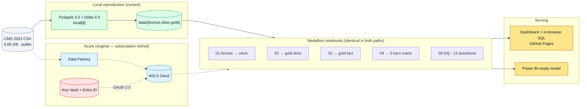

# Medicare Reimbursement Gap Analyzer

**9.66 million Medicare claims → a Bronze/Silver/Gold lakehouse → a dashboard that runs SQL over every row in your browser.**

### ⟶ **[Open the live dashboard](https://diazsk.github.io/healthcare-lakehouse-azure/)** · **[Query the data yourself](https://diazsk.github.io/healthcare-lakehouse-azure/explore.html)**

**Pipeline** `PySpark 3.5` · `Delta Lake` · `Azure Databricks` · `ADLS Gen2` · `Azure Data Factory` · `Key Vault` · `Microsoft Entra ID` · `Terraform` · `Python 3.11` · `SQL` · `Parquet`<br>
**Serving** `DuckDB` · `DuckDB-WASM` · `WebAssembly` · `Chart.js` · `Power BI` · `marimo` · `Plotly`

|  |  |
|---|---|
| **Scale** | 9,660,252 claim rows · 3.06 GB source · 9 Gold Delta tables |
| **Runtime** | Full pipeline in **231 seconds** on a laptop |
| **Serving** | Static site, **no backend** — DuckDB compiled to WebAssembly queries 9.66M rows client-side |
| **Rigor** | 13 data-quality gates · 10 parity assertions · 108 automated tests |
| **Honesty** | **2 of 5 hypotheses refuted** — and the dashboard says so |

---

## What the data showed

I wrote five hypotheses before writing any transformations. Three held, two didn't — and the two failures are the interesting part.

| # | Hypothesis | Verdict |
|---|---|---|
| 1 | Geography moves the price of identical procedures | ✅ **$245.7M** spread between extreme states, after stripping geographic adjustment |
| 2 | Non-participating providers charge patients a premium | ❌ **Refuted.** Non-participation is extinct — 1,130 of 1,175,213 providers (0.096%) — and they bill patients *less* |
| 3 | Drug spend concentrates in few prescribers | ✅ **Gini 0.906.** Top 1% of prescribers = 48.9% of all J-code spend |
| 4 | Markup differs by provider credential | ✅ **Inverted.** PAs (2.72x) and NPs (2.69x) exceed physicians (2.23x) |
| 5 | Facility billing costs Medicare more | ❌ **Refuted.** 830 of 972 codes pay the physician *less* in a facility |

> Hypothesis 2's headline "+2,223% premium" rested on **11 providers**. The dashboard renders it with an `n=11 · thin sample` badge rather than as a finding — warn, don't hide.

---

## What's technically interesting

- **One variable switches cloud → laptop.** Every path resolves through one function, so `LAKEHOUSE_LOCAL_ROOT` redirects the whole pipeline — no fork. That mattered when the Azure subscription was retired mid-project.
- **A database in the browser.** Gold compiles to tiered Parquet; DuckDB-WASM reads it by HTTP range request, so the 52 MB detail tier is *never downloaded*.
- **Aggregation destroys predicates.** A cube can't reproduce a row-level filter. One panel was **41% wrong and looked plausible** until a [parity gate](pipeline/verify_explorer_parity.py) caught it.
- **A passing test can be a lie.** Two of my 13 quality assertions used `isin("F","O",None)` — a NULL inside `isin` makes the predicate NULL for every row, so they could never fail.

---

<details>
<summary><b>Run it yourself</b> — four commands, no Azure account</summary>

```bash
uv venv --python 3.11 .venv-local && uv pip install --python .venv-local/bin/python -r requirements-local.txt
./pipeline/download.sh                                # 3.06 GB from CMS, resumable
.venv-local/bin/python pipeline/run_local.py          # full medallion chain, ~231s
.venv-local/bin/python pipeline/publish_dashboard.py  # rebuild + verify both surfaces
python3 -m http.server -d docs 8000                   # http://localhost:8000
```

Needs Python 3.11, Java 8/11/17, ~30 GB disk, 16 GB RAM. No Azure account, no credentials.
`run_local.py` writes a transcript to [`pipeline/RUN_LOG.md`](pipeline/RUN_LOG.md) — row counts, per-notebook timings, all 13 assertions.

</details>

<details>
<summary><b>Architecture</b> — Medallion on Azure, reproducible locally</summary>



The dotted path is the original Azure execution; the solid path is how it runs today. The notebooks in the middle are byte-for-byte identical.

- **Bronze** — raw CSV, `string`-only (no `inferSchema` on 3 GB), append-only, never mutated.
- **Silver** — typed and cleansed, `DECIMAL(18,2)` money / `DECIMAL(12,6)` ratios, derived flags.
- **Gold** — 3 dimensions + 1 narrow fact at 9.66M rows, plus 5 purpose-built marts (211–221,364 rows each).

| Notebook | Output |
|---|---|
| `01_bronze_to_silver` | Typed Silver Delta table, 28 explicit casts |
| `02_silver_to_gold_dims` | `dim_provider`, `dim_hcpcs`, `dim_geography` |
| `03_silver_to_gold_fact` | `fact_provider_service` — grain `NPI × HCPCS × place-of-service` |
| `04_gold_hero_marts` | The 5 hero marts |
| `99_dq_checks` | 13 hard assertions — nulls, domains, uniqueness, float drift |
| `100_register_tables` | Hive metastore registration (Databricks only) |

**Key helpers.** `utils/paths.py` is the path chokepoint every path flows through. `utils/__init__.py` runs before any SparkSession and supplies the `dbutils` shim plus `PYSPARK_SUBMIT_ARGS` — in `local[*]` the driver *is* the executor, so the 9 GB heap must be set before the JVM starts.

**One portability fix:** notebook 01 dropped `multiLine=true`, which made the 3 GB CSV non-splittable and pinned the pipeline to one core (~70 min → 4 min). That no field contains a newline was verified, not assumed — `wc -l` and Spark's `read.text` agree exactly with the parsed row count.

</details>

<details>
<summary><b>The interactive layer</b> — how 9.66M rows became queryable in a browser</summary>

The narrative renders from an 88 KB payload and always works. A toggle swaps every panel's source to **live SQL over all 9,660,252 rows**, run by DuckDB-WASM in the visitor's browser. No backend: GitHub Pages serves Parquet, DuckDB reads it by HTTP range request.

| Tier | Files | Size | Loaded when |
|---|---|---|---|
| 1 | `cube_dims`, `cube_code`, `cube_code_h4`, `cohorts` | 3.7 MB | the toggle is switched on |
| 2 | `providers_drug` | 5.6 MB | a panel needs provider grain |
| 3 | `cube_full`, `providers` | 52 MB | registered as a **view** — range-scanned, never fully downloaded |

**Why pre-aggregated cubes need help.** Aggregation makes the data small enough to ship, but it destroys row-grain predicates — a mart filtering `Tot_Srvcs >= 25` per claim row can't be reproduced from a cube that already summed those rows, because a `HAVING` on the sum is a different filter. Three panels needed something materialized at build time:

- Hero 1 needs `in_top50_basket` as a cube dimension, not a query-time `IN` list.
- Hero 4 needs a pre-filtered cube — its row-grain threshold has no post-aggregation equivalent.
- Hero 2 needs additive product columns, because its figure is beneficiary-weighted while the cube's totals are service-weighted. A sum of products stays additive through any `GROUP BY`; a ratio does not.

Each was found by measurement, not review. [`verify_explorer_parity.py`](pipeline/verify_explorer_parity.py) holds 10 assertions that the live queries reproduce published figures to the cent — including specific *cells*, not just totals, because an aggregate check once passed while all 36 of its constituent cells were wrong.

**A second page for open questions.** [`explore.html`](docs/explore.html) adds a pivot builder over any row/column/measure/filter combination, plus a `SELECT`-only SQL box capped at 5,000 rows. Filter state round-trips through the URL hash so a slice can be shared — the SQL text deliberately does not, since a URL is untrusted input.

**Degradation is designed.** Over `file://`, with WebAssembly unavailable, or with the CDN blocked, the toggle explains itself and the page stays on the static payload with all 8 charts intact. First paint makes **zero external requests**.

</details>

<details>
<summary><b>Reproduction fidelity</b> — proving the local rebuild matches Azure</summary>

| | Azure Databricks | Local rebuild |
|---|---|---|
| Bronze rows | 9,665,647 | 9,660,647 |
| `fact_provider_service` rows | 9,665,252 | 9,660,252 |
| **Rows dropped by `Cntry = 'US'`** | **395** | **395** |
| DQ assertions | 13 pass | 13 pass |

The filter delta reproduces **exactly** — that's the signal the transformations are identical. The 5,000-row gap is upstream: CMS republished the 2023 file (revision `R25_P05_V20`, April 2025) with 5,000 fewer rows. Confirmed by three independent sources — `wc -l`, Spark's `read.text`, and the CMS API's `/data/stats` endpoint. At 0.05% it changes no finding.

**Three data-quality checks were defective, and re-running exposed them.** `decimal_drift_zero` asserted an *absolute* sub-cent difference between a float sum and an exact decimal sum — but that quantity depends on the summation tree, and therefore partition count. It passed on Databricks at $0.0025 and measured **$0.8470** locally, where it would have failed. Now relative (`drift / total < 1e-9`). Two others, `pos_in_domain` and `ent_in_domain`, were vacuous: `isin("F","O",None)` makes the predicate NULL for every row, so they could never fail.

</details>

<details>
<summary><b>Other ways to run it</b> — Azure, marimo, Power BI</summary>

**Azure Databricks (original path, still intact).** Requires a subscription.

```bash
cd infrastructure && terraform init
terraform apply -var="service_principal_object_id=<your-sp-object-id>"
az ad sp credential reset --id <your-sp-app-id>
az keyvault secret set --vault-name kv-healthcare-plat-dev --name sp-databricks-client-secret --value '<rotated-secret>'
```

Terraform provisions the resource group, ADLS Gen2 (HNS, TLS 1.2, LRS), Key Vault, role assignment, Data Factory and a Premium Databricks workspace. Upload `notebooks/`, attach a Photon cluster with **10-minute auto-terminate** (a standing FinOps invariant), and run `01 → 02 → 03 → 04 → 99 → 100`. Leave `LAKEHOUSE_LOCAL_ROOT` unset and the `abfss://` paths apply automatically.

**Authentication.** Databricks reads the SP client secret from a Key-Vault-backed scope, which authenticates to ADLS via OAuth 2.0 client credentials. Locally there is no authentication at all: `configure_adls_oauth()` returns early and the `dbutils.secrets` shim *raises* rather than returning a placeholder. No secret has ever been committed — verified across full history.

**marimo reactive app.** Requires a completed local run; every figure cross-checks to the cent against the published dashboard.

```bash
LAKEHOUSE_LOCAL_ROOT="$PWD/data" .venv-local/bin/marimo edit dashboard/medicare_analytics_dashboard.py
```

**Power BI.** The star schema, full DAX measure set and a click-by-click build guide are in [`powerbi/`](powerbi/). Run `python pipeline/export_powerbi.py` to emit Gold as Parquet. **Power BI Desktop is Windows-only, so there is no `.pbix` here** — the model is fully specified and the build is mechanical, but it needs a Windows machine. The static dashboard is the primary serving layer.

</details>

<details>
<summary><b>Repository layout</b></summary>

```
docs/                      # THE DELIVERABLE — GitHub Pages
├── index.html             # Dashboard + inlined 88 KB payload
├── explore.html           # Pivot builder + SQL box
├── js/                    # format · charts · panels · guardrails · engine · live · permalink
└── data/*.parquet         # Tiered query surface, 61 MB

pipeline/                  # Local reproduction harness (no Azure)
├── download.sh            # Fetch + byte-verify the CMS source
├── run_local.py           # Execute the notebook chain in one JVM
├── publish_dashboard.py   # Gold → payload, chained into the builder + parity gate
├── build_explorer_data.py # Gold → tiered Parquet
├── verify_explorer_parity.py
└── RUN_LOG.md             # Transcript of real runs

notebooks/                 # PySpark medallion (Databricks OR local)
└── utils/                 # paths.py is the chokepoint; __init__.py the bootstrap

powerbi/                   # MODEL.md · MEASURES.md · BUILD_GUIDE.md
dashboard/                 # marimo reactive app
infrastructure/            # Terraform IaC
```

</details>

<details>
<summary><b>About the data</b> — source, grain, and two caveats that shape everything</summary>

[**Medicare Physician & Other Practitioners — by Provider and Service (2023)**](https://data.cms.gov/provider-summary-by-type-of-service/medicare-physician-other-practitioners/medicare-physician-other-practitioners-by-provider-and-service) · CMS · 9,660,647 rows / 3.06 GB · **Public Domain**

Grain: `NPI × HCPCS × place-of-service`, 28 columns. The dataset reports **Submitted Charge**, **Medicare Allowed**, **Medicare Paid**, and **Medicare Standardized** (paid, with geographic adjustment removed) — the relationships between those four drive every insight here.

- **Suppression.** CMS withholds any provider-service row covering fewer than 11 beneficiaries, so all totals understate true national volume.
- **`Tot_Benes` is not a patient count.** It is per-row, so summing across procedures double-counts patients. Every per-beneficiary figure here is labelled a *proxy*.

Published by the Centers for Medicare & Medicaid Services. This is independent analytical work, not affiliated with or endorsed by CMS, and nothing here is a finding of fraud, waste, or abuse — billing variation has many legitimate causes including case mix, geography, and practice setting.

</details>

---

**Zaid Shaikh** — MS Computer Science, Northeastern University Seattle. Licensed [MIT](LICENSE.md).

[](https://www.linkedin.com/in/zaidshaikhengineer/)
[](https://github.com/DiazSk)
